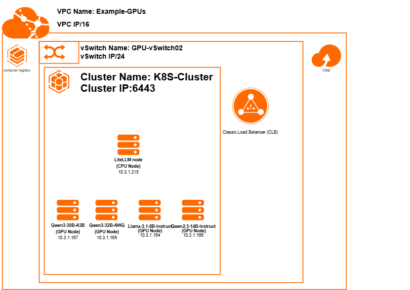

# Deploying Large Language Models at Scale on Alibaba Cloud ACK using LiteLLM and vLLM

Deploy and serve multiple open-source Large Language Models (LLMs) on Alibaba Cloud ACK using GPU-accelerated nodes, vLLM for high-performance inference, LiteLLM for unified API access, and OSS-backed persistent storage.

This project demonstrates how to build a production-ready multi-model inference platform capable of serving Qwen, Llama, Gemma, GPT-OSS, and future open-source models through a single OpenAI-compatible endpoint.

---

## Overview

As organizations adopt multiple LLMs for different use cases, managing individual model endpoints becomes increasingly complex. Each model may require different hardware resources, deployment strategies, and API integrations.

This solution simplifies model serving by combining:

* **Alibaba Cloud ACK** for container orchestration
* **vLLM** for efficient GPU inference
* **LiteLLM** for unified API routing
* **Alibaba Cloud OSS** for model storage
* **Persistent Volumes (PV/PVC)** for model mounting
* **Open WebUI** for validation and testing

The result is a scalable architecture that allows developers to access multiple models through a single endpoint while maintaining Kubernetes-native operations.

---

# Architecture



### Editable Diagram

The architecture diagram is included in Draw.io format:

```text
Example-HLD.drawio
```

---

# Solution Architecture

The platform consists of four major layers:

### Client Layer

Applications, internal users, AI agents, or Open WebUI connect through a unified endpoint.

### API Gateway Layer

LiteLLM acts as an OpenAI-compatible gateway and routes requests to the appropriate model backend.

### Inference Layer

Each model runs independently on a dedicated GPU node using vLLM.

### Storage Layer

Model weights are stored in Alibaba Cloud OSS and mounted into Kubernetes pods using Persistent Volumes and Persistent Volume Claims.

---

# Infrastructure Requirements

This reference architecture is designed for a typical production deployment of 4 concurrent LLM models on Alibaba Cloud.

| Component                | Quantity | Notes                         |
| ------------------------ | -------- | ----------------------------- |
| ACK Cluster              | 1        | Managed Kubernetes cluster    |
| CPU Nodes                | 1        | For LiteLLM gateway           |
| GPU Nodes                | 4        | ecs.gn8is.2xlarge (L20 GPUs) |
| OSS Bucket               | 1        | Model storage                 |
| CLB / Ingress            | 1        | External access               |
| Persistent Volumes       | 4+       | Model mounts                  |
| Persistent Volume Claims | 4+       | Pod volume bindings           |

---

# GPU Selection Guide

Choosing the right GPU is one of the most important decisions when designing an LLM inference platform. Alibaba Cloud provides multiple GPU instance families optimized for different workloads. Your choice depends on model size, throughput requirements, and budget constraints.

Refer to the official [GPU-Accelerated Compute-Optimized Instance Families](https://www.alibabacloud.com/help/en/egs/gpu-accelerated-compute-optimized-instance-families) documentation for complete specifications.

| GPU Instance Family | GPU Type | VRAM | Primary Use Case |
| --- | --- | --- | --- |
| **ecs.gn6i.\*** | NVIDIA T4 | 16 GB | Entry-level inference (Llama 3.1 8B, Qwen 7B) |
| **ecs.gn6v.\*** | NVIDIA V100 | 16 GB | General-purpose inference |
| **ecs.gn8is.\*** | NVIDIA L20 | 48 GB | **Production LLM inference** (recommended) |
| **ecs.gn8ia.\*** | NVIDIA H20 | 96 GB | Large-scale training and inference |

---

## Model Comparison for L20 GPU Deployments

The NVIDIA L20 GPU (48 GB VRAM) in Alibaba Cloud's **ecs.gn8is.\*** instance family is the optimal choice for serving modern open-source LLMs. Use this table to select the right model for your requirements:

| Model | Parameters | Quantization | Recommended GPU | VRAM Usage |
| --- | --- | --- | --- | --- |
| Llama 3.1 8B Instruct | 8B | FP16 | 1 × L20 | ~16-20 GB |
| Gemma 3 12B | 12B | FP16 | 1 × L20 | ~24-30 GB |
| Qwen2.5 14B Instruct | 14B | FP16 | 1 × L20 | ~28-35 GB |
| GPT-OSS 20B | 20B | AWQ | 1 × L20 | ~20-30 GB |
| Qwen3 32B AWQ | 32B | AWQ 4-bit | 1 × L20 | ~20-28 GB |
| Qwen3 30B A3B | 30B MoE | BitsAndBytes | 1 × L20 | ~17-22 GB |
| Gemma 3 27B | 27B | AWQ | 1 × L20 | ~25-35 GB |
| Llama 3.3 70B | 70B | AWQ | 4 × L20 | Multi-GPU |
| GPT-OSS 120B | 120B | Quantized | 8 × L20 | Multi-GPU |

### Key Notes

- **Single-GPU Deployment**: All models up to 32B parameters fit within a single L20 GPU (48 GB VRAM)
- **Multi-GPU Tensor Parallelism**: Models with 70B+ parameters require tensor parallelism across multiple L20 GPUs
- **Quantization Impact**: Using quantization formats (AWQ, BitsAndBytes) significantly reduces VRAM requirements while maintaining model quality
- **Model Selection**: Choose based on your latency, accuracy, and throughput requirements

### VRAM Estimation Resources

To calculate exact VRAM requirements for your specific models and quantization formats:

* **[Can I Run It?](https://www.canirun.ai/)** - Interactive tool to verify model compatibility with your GPU VRAM
* **[Hugging Face Memory Calculator](https://alvarobartt.com/hf-mem/)** - Detailed VRAM utilization calculator for different model sizes and quantization methods

These tools help you determine optimal quantization strategies and verify model-GPU compatibility before deployment.

---

# ACK Cluster Layout

```text
ACK Cluster
│
├── CPU Node
│   └── LiteLLM Gateway
│
├── GPU Node 1
│   └── Llama-3.1-8B-Instruct
│
├── GPU Node 2
│   └── Qwen2.5-14B-Instruct
│
├── GPU Node 3
│   └── Qwen3-32B-AWQ
│
└── GPU Node 4
    └── Qwen3-30B-A3B
```

---

# How the Platform Works

### Step 1

Users connect to Alibaba Cloud through a Load Balancer or Ingress endpoint.

### Step 2

Requests are forwarded to LiteLLM running on a dedicated CPU node.

### Step 3

LiteLLM identifies the requested model and forwards the request to the appropriate vLLM deployment.

### Step 4

vLLM performs inference using GPU resources and returns the response.

### Step 5

LiteLLM returns the result using an OpenAI-compatible API format.

---

# Understanding Core Components

## What is ACK?

Alibaba Cloud Container Service for Kubernetes (ACK) is a fully managed Kubernetes service that simplifies cluster operations while providing a standard Kubernetes environment.

ACK handles:

* Cluster lifecycle management
* Node scaling
* Networking
* Security integration
* Monitoring integration

---

## What is LiteLLM?

LiteLLM acts as a centralized API gateway for all deployed models.

Benefits include:

* Single API endpoint
* OpenAI SDK compatibility
* Unified authentication
* Model abstraction
* Easy model switching

```text
Client
   │
   ▼
LiteLLM
   │
 ┌─┴─────────────┐
 ▼              ▼
vLLM          vLLM
Qwen          Llama
```

---

## What is vLLM?

vLLM is a high-performance LLM inference engine optimized for GPU utilization.

Features include:

* Continuous batching
* OpenAI-compatible API
* Tensor parallelism
* Quantization support
* High throughput inference

---

## What are Persistent Volumes?

Model weights can exceed tens of gigabytes. Downloading models every time a pod starts increases startup time and operational complexity.

Instead, models are stored in OSS and mounted directly into pods.

```text
OSS
 │
 ▼
Persistent Volume
 │
 ▼
Persistent Volume Claim
 │
 ▼
vLLM Pod
```

---

# Model Selection Guide

| Use Case                   | Recommended Model      | Rationale                                          |
| -------------------------- | ---------------------- | -------------------------------------------------- |
| General Chat               | Llama-3.1-8B-Instruct  | Balanced performance, low memory footprint         |
| Lightweight Deployments    | Gemma-3-12B            | Efficient, cost-effective for simple tasks         |
| Arabic Language Tasks      | Qwen2.5-14B-Instruct   | Strong multilingual support                        |
| Coding Assistance          | Qwen3-30B-A3B          | MoE architecture optimizes code understanding      |
| Agentic Workflows          | Qwen3-30B-A3B          | Better reasoning for complex agent behaviors       |
| Advanced Reasoning         | Qwen3-32B-AWQ          | Highest capability in single-GPU setting          |
| Research & Experimentation | GPT-OSS 20B            | Versatile, good for benchmarking                   |
| High-Performance Inference | Gemma-3-27B            | Advanced reasoning on single GPU                   |
| Multi-GPU Deployments      | Llama-3.3-70B / GPT-OSS-120B | Enterprise-scale applications |

---

# Storage Layout

Example OSS structure:

```text
oss://modelshugging/
├── Llama-3.1-8B-Instruct/
├── Qwen2.5-14B-Instruct/
├── Qwen3-30B-A3B/
└── Qwen3-32B-AWQ/
```

---

# Prerequisites

## Alibaba Cloud Resources

* Alibaba Cloud Account
* ACK Cluster
* OSS Bucket
* Container Registry (ACR)
* VPC
* vSwitches
* CLB or Ingress

## External Requirements

* Hugging Face Account
* Hugging Face Access Token

## Client Tools

```bash
kubectl
ossutil
docker
helm
```

---

# Upload Models to OSS

```bash
ossutil cp Llama-3.1-8B-Instruct \
oss://modelshugging/Llama-3.1-8B-Instruct -r

ossutil cp Qwen2.5-14B-Instruct \
oss://modelshugging/Qwen2.5-14B-Instruct -r

ossutil cp Qwen3-30B-A3B \
oss://modelshugging/Qwen3-30B-A3B -r

ossutil cp Qwen3-32B-AWQ \
oss://modelshugging/Qwen3-32B-AWQ -r
```

---

# Deploy LiteLLM

```bash
kubectl apply -f k8s/litellm-config.yaml

kubectl apply -f k8s/litellm-deployment.yaml
```

---

# Deploy Models

```bash
kubectl apply -f k8s/Llama-3.1-8B-Instruct.yaml

kubectl apply -f k8s/Qwen2.5-14B-Instruct.yaml

kubectl apply -f k8s/Qwen3-32B-AWQ.yaml

kubectl apply -f k8s/Qwen3-30B-A3B.yaml
```

---

# Validation with Open WebUI

After deployment, Open WebUI can be connected directly to LiteLLM.

```text
Open WebUI
      │
      ▼
LiteLLM
      │
      ▼
vLLM Models
```

Example configuration:

```env
OPENAI_API_BASE_URL=http://litellm-service:4000/v1
OPENAI_API_KEY=dummy
```

### Proof of Concept

Add a screenshot demonstrating successful model interaction:

```markdown

```

This validates:

* LiteLLM routing
* vLLM inference
* ACK networking
* OSS-backed model loading
* OpenAI-compatible API functionality

---

# Useful Kubernetes Commands

### View Nodes

```bash
kubectl get nodes -o wide
```

### View GPU Resources

```bash
kubectl get nodes \
-o custom-columns=NAME:.metadata.name,GPU:.status.allocatable.nvidia\.com/gpu
```

### View Pods

```bash
kubectl get pods -A
```

### View Services

```bash
kubectl get svc -A
```

### View Logs

```bash
kubectl logs <pod-name>
```

### Check GPU Usage

```bash
kubectl exec -it <pod-name> -- nvidia-smi
```

### Describe GPU Node

```bash
kubectl describe node <gpu-node-name>
```

---

# Screenshots

```markdown


```

---

# Scaling & Performance Considerations

## Single-GPU Optimization

For models fitting within 48 GB L20 VRAM:

* Use quantization (AWQ, BitsAndBytes) to reduce memory footprint
* Enable continuous batching in vLLM for higher throughput
* Tune tensor parallel strategy if needed
* Monitor GPU utilization with `nvidia-smi`

## Multi-GPU Tensor Parallelism

For models requiring multiple GPUs (70B+):

* Use vLLM's tensor parallelism with OpenAI-compatible API
* Scale to 2-4 L20 GPUs per model depending on size
* Distribute across multiple GPU nodes via Kubernetes scheduling
* Example: Llama 3.3 70B on 4 × L20 (12 GB per GPU)

## Horizontal Scaling

Add more GPU nodes to ACK cluster:

* Deploying additional model replicas for load balancing
* Serving larger models without consolidation
* Improving inference latency through parallelization
* Dynamic scaling based on request volume

---

# Future Enhancements

The architecture can easily be extended to support:

* Gemma 3 27B deployments
* Qwen3.7 Plus models
* Larger models via multi-GPU tensor parallelism
* Multi-Region ACK Clusters for HA/DR
* RAG (Retrieval-Augmented Generation) Pipelines
* Agentic AI Workloads with function calling
* Advanced scheduling and resource optimization
* Cost optimization through spot instances

---

# References & Resources

## Alibaba Cloud

* [Alibaba Cloud ACK Documentation](https://www.alibabacloud.com/help/en/container-service-for-kubernetes)
* [Alibaba Cloud OSS Documentation](https://www.alibabacloud.com/help/en/object-storage-service)
* [ECS GPU Instance Families](https://www.alibabacloud.com/help/en/elastic-compute-service/latest/gpu-compute-optimized-instances)
* [GN8IS Instance Family (L20 GPU)](https://www.alibabacloud.com/help/en/elastic-compute-service/latest/gn8is-instance-family)

## Open-Source Tools & Frameworks

* [Kubernetes Documentation](https://kubernetes.io/docs/)
* [vLLM - High-Performance LLM Inference](https://docs.vllm.ai/)
* [LiteLLM - OpenAI-Compatible API Gateway](https://docs.litellm.ai/)
* [Open WebUI](https://github.com/open-webui/open-webui)

## Model Sources & Tools

* [Hugging Face Model Hub](https://huggingface.co/models)
* [Meta Llama Models](https://huggingface.co/meta-llama)
* [Qwen Models - Alibaba Cloud](https://huggingface.co/Qwen)
* [Google Gemma Models](https://huggingface.co/google)
* [OpenAI GPT-OSS](https://huggingface.co/openai)

## VRAM Estimation & Compatibility Tools

* [Can I Run It? - GPU Model Compatibility](https://www.canirun.ai/) - Interactive tool to verify model compatibility with specific GPU VRAM
* [Hugging Face Memory Calculator](https://alvarobartt.com/hf-mem/) - Calculate exact VRAM utilization for different model sizes and quantization methods
